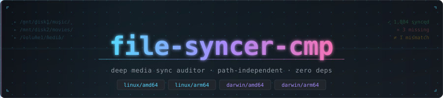
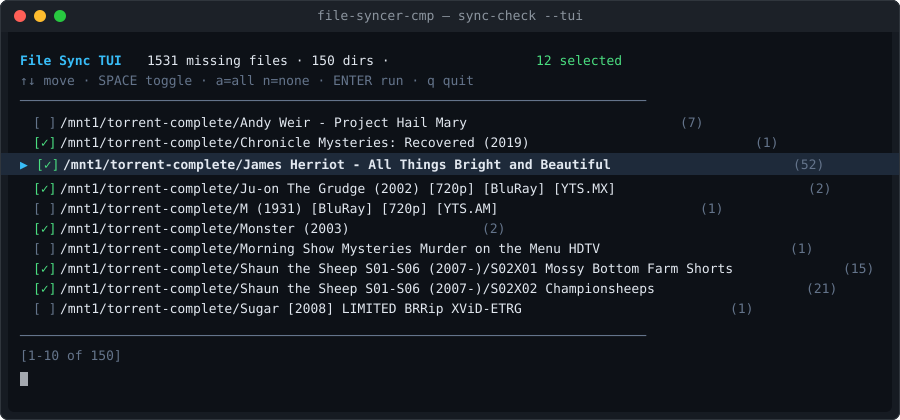
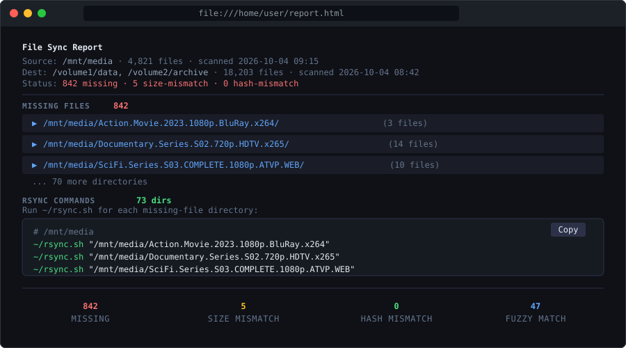

<p align="center">
  
</p>

[](https://github.com/slmingol/file-syncer-cmp/actions/workflows/ci.yml)
[](https://github.com/slmingol/file-syncer-cmp/actions/workflows/release.yml)
[](https://goreportcard.com/report/github.com/slmingol/file-syncer-cmp)


Compare media files between two locations — even when the directory structure has been reorganized. Designed for auditing rsync'd content from a Transmission server to a NAS.

**Matches by filename + size, not path.** A file moved from `artist/album/track.flac` to `music/various/track.flac` is still considered synced.

---

## Install

Download the binary for your platform from [Releases](https://github.com/slmingol/file-syncer-cmp/releases):

| Platform | Binary |
|---|---|
| Linux x86_64 | `file-syncer-cmp-linux-amd64` |
| Linux ARM64 (NAS, Pi) | `file-syncer-cmp-linux-arm64` |
| macOS Intel | `file-syncer-cmp-darwin-amd64` |
| macOS Apple Silicon | `file-syncer-cmp-darwin-arm64` |

```bash
chmod +x file-syncer-cmp-linux-arm64
mv file-syncer-cmp-linux-arm64 /usr/local/bin/file-syncer-cmp
```

Or via Homebrew (macOS):

```bash
brew tap slmingol/tap
brew install file-syncer-cmp
```

Or build from source (requires Go 1.26+):

```bash
go install github.com/slmingol/file-syncer-cmp@latest
```

---

## Typical workflow (Transmission → NAS)

```bash
# 1. On the NAS — scan all media locations into one index:
./file-syncer-cmp-linux-arm64 scan /volume2/data /volume1/home --output nas.json

# 2. Copy nas.json to the Transmission host:
scp nas:/home/slm/nas.json ~/

# 3. On the Transmission host — scan source disk(s):
./file-syncer-cmp-linux-arm64 scan /mnt1/torrent-complete --output mnt1.json

# 4. Compare and launch the interactive TUI to selectively rsync:
./file-syncer-cmp-linux-arm64 compare --dest nas.json mnt1.json \
  --fuzzy \
  --ignore 'RARBG*,www.*,*.nfo' \
  --rsync-script ~/rsync.sh \
  --tui
```

The TUI invokes `rsync.sh` from the scan root with a **relative path** as `$1` (e.g. `DAY6/Solo/Wonpil/[Album]`). Your script must use `rsync --relative` to preserve the full directory structure at the destination:

```bash
#!/usr/bin/env bash
# ~/rsync.sh — called from source root with relative subpath as $1
rsync -av --relative "$1" slm@nas-host:~/movies/incoming/
```

Without `--relative`, rsync copies only the final path component (`[Album]`) directly into the destination, losing the ancestor structure.

On subsequent runs, skip unchanged dirs with `--incremental`:

```bash
./file-syncer-cmp-linux-arm64 scan /volume2/data /volume1/home --output nas.json --incremental
```

Scan output shows live file count during scanning, per-root timing, and a summary:

```
  ┄┄┄┄┄┄┄┄┄┄┄┄┄┄┄┄┄┄┄┄┄┄┄┄┄┄┄┄┄┄┄┄┄┄┄┄┄┄┄┄┄┄┄┄┄┄┄┄┄┄┄┄┄┄┄┄┄┄
  incremental  /home/slm/nas.json · 315,522 files · scanned 2026-10-04 11:03
  ┄┄┄┄┄┄┄┄┄┄┄┄┄┄┄┄┄┄┄┄┄┄┄┄┄┄┄┄┄┄┄┄┄┄┄┄┄┄┄┄┄┄┄┄┄┄┄┄┄┄┄┄┄┄┄┄┄┄

  /volume2/data                               315,338 files  19.0s
  /volume1/home                                   185 files  34ms

  ┄┄┄┄┄┄┄┄┄┄┄┄┄┄┄┄┄┄┄┄┄┄┄┄┄┄┄┄┄┄
✓  315,523 files across 2 roots  → /home/slm/nas.json  20.5s
  ┄┄┄┄┄┄┄┄┄┄┄┄┄┄┄┄┄┄┄┄┄┄┄┄┄┄┄┄┄┄
```

---

Pressing Enter stays in TUI raw mode and shows a full-screen rsync HUD:

```
  ┄┄┄┄┄┄┄┄┄┄┄┄┄┄┄┄┄┄┄┄┄┄┄┄┄┄┄┄┄┄┄┄┄┄┄┄┄┄┄┄┄┄┄┄┄┄┄┄┄┄┄┄┄┄┄┄
  rsyncing  [2/5]  /mnt3/torrent-complete/Law and Order SVU Season 20...
  ┄┄┄┄┄┄┄┄┄┄┄┄┄┄┄┄┄┄┄┄┄┄┄┄┄┄┄┄┄┄┄┄┄┄┄┄┄┄┄┄┄┄┄┄┄┄┄┄┄┄┄┄┄┄┄┄

  ✓ Law & Order SVU S20E05 Accredo.mkv         [5/25]  9.9MB/s
  ✓ Law & Order SVU S20E06 Exile.mkv           [6/25]  9.3MB/s
  → Law & Order SVU S20E07 Caretaker.mkv

  q abort
```

`[N/T]` shows rsync's xfr count / total. The denominator grows as rsync discovers the full file list incrementally — this is normal rsync behavior. Once done, the HUD shows `done` and waits for any key to return to the dir list.

---

## Interactive TUI

<p align="center">
  
</p>

Select which directories to sync, then confirm each one (or press `a` to run all):

| Key | Action |
|---|---|
| `↑` / `↓` | Navigate |
| `Space` | Toggle selection |
| `a` | Select all |
| `n` | Deselect all |
| `Enter` | Run rsync for selected dirs |
| `q` | Quit |

At the rsync prompt:

| Key | Action |
|---|---|
| `y` | Run this dir |
| `a` | Run this and all remaining without prompting |
| `N` | Skip this dir |
| `q` | Quit |

---

## HTML Report

<p align="center">
  
</p>

```bash
file-syncer-cmp compare --dest nas.json mnt1.json mnt2.json \
  --fuzzy --format html > report.html
```

Missing files are grouped by directory (collapsed by default — click to expand). The report includes a **Rsync Commands** section with pre-built `~/rsync.sh` calls for every missing directory, and a **Copy** button.

---

## Output categories

| Category | Meaning |
|---|---|
| **Missing** | File in source, not found anywhere in dest by name+size |
| **Size mismatch** | Name found in dest but byte count differs (possible re-encode) |
| **Hash mismatch** | Same name + size, different content — requires `--hash` |
| **Fuzzy match** | Not an exact match but likely the same file — renamed or episode renumbered |

Fuzzy match sub-reasons:

| Reason | Example |
|---|---|
| `substring` | Dest has `S01E01__Show Name.mkv`, source has `Show Name.mkv` |
| `episode-renumbered` | Source `S01E02 Title.mkv` matched to dest `S01E03 Title.mkv` (dual-episode shifted numbering) |
| `episode-reencoded` | Source `Show.S04E01.720p.HEVC.x265-Group.mkv` matched to dest `Show.S04E01.720p.ATVP.WEB.mp4` (same episode, different encode) |

---

## All flags

### `scan`

| Flag | Default | Description |
|---|---|---|
| `--output` | stdout | Write index to file |
| `--ext` | media files | Comma-separated extensions, e.g. `mp3,flac,mkv` |
| `--hash` | off | Compute partial content hash (first + last 512 KB) |
| `--workers` | 8 | Parallel scan workers |
| `--incremental` | off | Reuse unchanged dirs from previous `--output` index |

Multiple paths can be scanned into one index:

```bash
file-syncer-cmp scan /volume2/data /volume1/home --output nas.json
```

Default extensions: `mp3 flac wav aac ogg opus m4a wma alac aiff mkv mp4 avi mov m4v ts m2ts wmv webm vob iso nfo srt ass sub`

### `compare`

| Flag | Default | Description |
|---|---|---|
| `--dest` | — | Destination index (required when passing multiple sources) |
| `--format` | `text` | Output format: `text`, `json`, `html` |
| `--hash` | off | Compare hashes (both indexes must include hashes) |
| `--fuzzy` | off | Match renamed/renumbered files (substring + episode-strip) |
| `--ignore` | — | Comma-separated filename globs to drop from missing, e.g. `RARBG*,www.*` |
| `--tui` | off | Launch interactive TUI instead of printing report |
| `--rsync-script` | `~/rsync.sh` | Script called with each selected directory path |
| `--rsync-src-root` | — | Override the source root used when invoking `--rsync-script`. Normally auto-detected from the scan index. |

### `sync-check`

Accepts all flags from both `scan` and `compare`. Scans both sides and compares in one step (requires both paths to be accessible simultaneously).

---

## Two-phase vs one-shot

| | Two-phase (`scan` + `compare`) | One-shot (`sync-check`) |
|---|---|---|
| Use when | Server and NAS not on same network simultaneously | Both paths mountable at once |
| NAS scan | Run on NAS, copy JSON over | Not needed |
| Incremental | Yes (`--incremental`) | No |

---

## License

MIT
